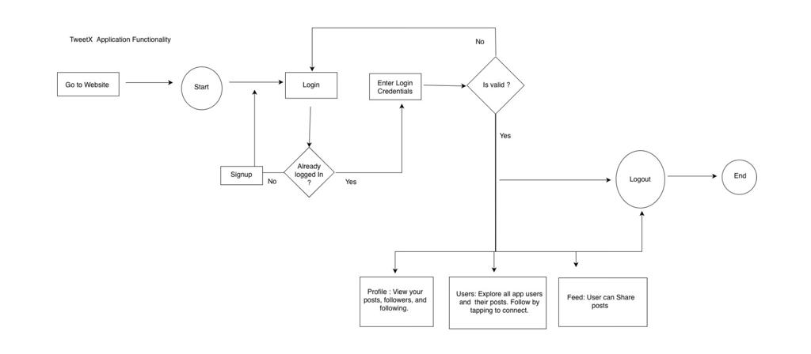
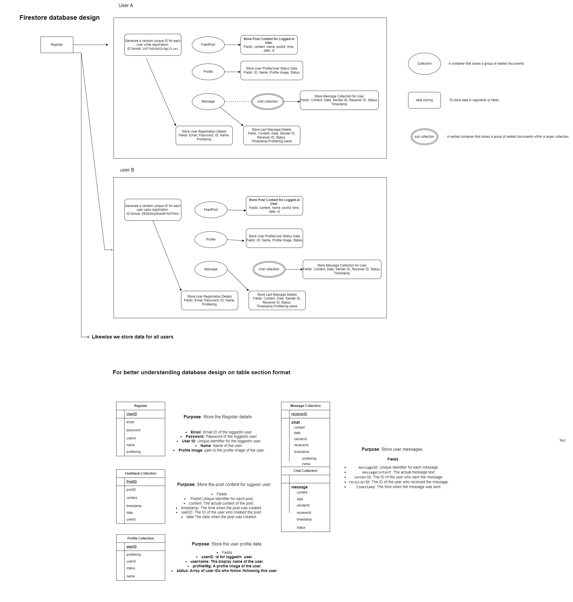

# Angular 16 Firebase TweetX-18 Application

## Project Overview:
This Angular 16 application uses Google Firebase on the backend and is like a social media platform inspired by Twitter. You can sign up, log in, share posts, follow friends, and see what others are posting

## Tech Stack:
- Frontend: Angular 16
- Backend: Google Firebase (Firestore Database)
- Hosting : Google Firebase

## Project Structure
The project is structured with the following modules:

- **Root Module:** Main entry point orchestrating the loading of other modules.
- **Angular Material Module:** Configurations related to Angular Material UI components.
- **Core:**
  - **Guard:** Router guards for security purposes.
  - **Service:** Handles data access and business logic.
  - **Model:** Defines data structures used in the application.
- **Login Module:**
  - **Login Component:** Responsible for user authentication and login interface.
- **Profile Module:** Manages user profiles, posts, Message and related functionalities.
- **Shared Module:**
  - **Components:** Reusable UI components like logout dialog, error dialog, and page-not-found.
  - **Service:** Shared services providing common functionality.
  - **Styles:** Common styles used across components.
- **Assets:**
  - **Images:** Stores images used in the application.
- **Environment:**
  - **environment.ts:** Firebase authentication configuration.

## Setup and Installation:
1. Clone the repository using the command 👉🏻 git clone https://github.com/csdheepan/tweetx.git

2. Verify Node.js and npm installation using the command node -v , npm -v :
- Node version: v18.19.0
- Npm version: 10.2.3
3. Navigate to the project directory.
4. Run `npm install` command to install the dependencies.
5. Run the application using `ng serve`.
6. The application is now running successfully on localhost. Please check your browser.

## Hosted Website:
The application is hosted on Google Firebase.

Link: [https://tweet-x-18.web.app](https://tweet-x-18.web.app)

## Functionality:
- **Sign Up and Login:** Users can create accounts and log in.
- **Posting Feed:** Users can share posts with the community.
- **Following Friends:** Users can follow and stay updated on posts from friends.
- **Avatar Customization:** Provide users the ability to change their avatars.
- **Add, Update, and Delete Posts:** Users can manage their posts by adding new posts, updating existing ones, and deleting posts they no longer want to keep.
- **Direct Messaging:** Allow users to send messages to each other.
- **Responsive Design:** The application is fully responsive for a seamless user experience.
- **Preview the diagram for better understanding:** 

## Future Improvements:
- **Additional features:** Enhancements done based on user experience.

## Database:
The application utilizes Google Firestore Database for efficient data storage and retrieval.

## Database Design:

## Contributing
Contributions are welcome! To contribute to this project, please follow these steps:

1. Fork the repository and create your branch from `master`.
2. Open an issue to discuss your proposed changes.
3. Make your modifications and ensure tests pass.
4. Submit a pull request detailing your changes and the problem they solve.

## Credits
We would like to acknowledge the following individuals, companies, and projects for their contributions to this project:

- [Omnipractice](https://omnipractice.co/): Provided draft designs and assigned the project.

Special thanks to Omnipractice for their valuable support and assistance throughout the development of this application.

## Contact Information:
For any questions or further information, feel free to contact:

- **Name:** Dheepan S
- **Email:** csdheepan18@gmail.com
- **Website:** [dheepanportfolio.in](https://dheepanportfolio.in)
