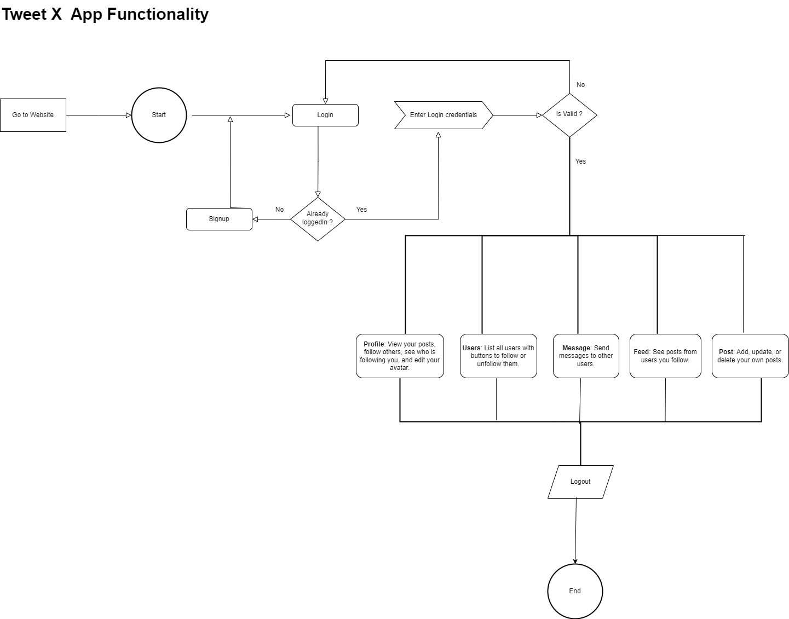

# Angular 16 Firebase TweetX-18 Application

## Project Overview:
This Angular 16 application uses Google Firebase on the backend and is like a social media platform inspired by Twitter. You can sign up, log in, share posts, follow friends, and see what others are posting

## Tech Stack:
- Frontend: Angular 16
- Backend: Google Firebase (Firestore Database)

## Project Structure:
The project is structured with the following modules:
- Root Module
- Profile Module (contains all components required for the application, excluding the login component)
- Core
    - Service: All service files
    - Model: Data model files

## Setup and Installation:
1. Clone the repository using the command 👉🏻 git clone https://github.com/csdheepan/tweetx.git

2. Verify Node.js and npm installation using:
- Node version: v18.19.0
- Npm version: 10.2.3
3. Navigate to the project directory.
4. Run `npm install` command to install the dependencies.
5. Run the application using `ng serve`.
6. The application is now running successfully on localhost. Please check your browser.

## Hosted Website:
The application is hosted on Google Firebase.

Link: [https://tweet-x-18.web.app](https://tweet-x-18.web.app)

## Functionality:
- **Sign Up and Login:** Users can create accounts and log in.
- **Posting Feed:** Users can share posts with the community.
- **Following Friends:** Users can follow and stay updated on posts from friends.
- **Responsive Design:** The application is fully responsive for a seamless user experience.
- **Preview the diagram for better understanding:** 

## Future Improvements:
- **Direct Messaging:** Allow users to send messages to each other.
- **Avatar Customization:** Provide users the ability to change their avatars.
- **Additional features and enhancements for an enriched user experience.

## Database:
The application utilizes Google Firestore Database for efficient data storage and retrieval.

## Database Design:

## Contact Information:
For any questions or further information, feel free to contact:

- **Name:** Dheepan S
- **Email:** csdheepan18@gmail.com
- **Website:** [dheepanportfolio.in](https://dheepanportfolio.in)

